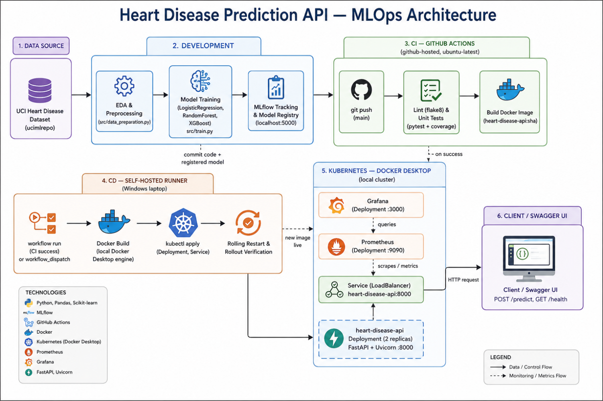

### Heart Disease Prediction API — End-to-End MLOps Project

An end-to-end MLOps implementation for predicting heart disease using the UCI Heart Disease dataset. The project demonstrates data preprocessing, model training, experiment tracking with MLflow, containerization with Docker, CI/CD with GitHub Actions, deployment on Kubernetes (Docker Desktop), and monitoring using Prometheus and Grafana.

### Project Overview

This project implements a production-style machine learning workflow that includes:

* Data ingestion and preprocessing
* Training multiple machine learning models
* Experiment tracking and model registry with MLflow
* FastAPI inference service
* Docker containerization
* Kubernetes deployment
* Automated CI/CD pipelines with GitHub Actions
* Monitoring with Prometheus and Grafana

### Project Structure
```
MLOps-Assignment-1/
├── .github/workflows/ # CI/CD pipelines
├── app/ # FastAPI application
├── data/ # Dataset files
├── docs/ # architecture diagram, report and video files
├── k8s/ # Kubernetes manifests
├── models/ # Trained model artifacts
├── monitoring/ # Monitoring configuration
├── notebooks/ # EDA notebooks
├── src/ # Training and preprocessing code
├── tests/ # Unit tests
├── Dockerfile
├── docker-compose.yml
├── requirements.txt
├── environment.yml
└── README.md
```
### Setup Instructions

### 1. Clone the Repository

git clone [https://github.com/ravikiran-k-19/MLOps-Assignment-1.git](https://github.com/ravikiran-k-19/MLOps-Assignment-1.git)
cd MLOps-Assignment-1

### 2. Create Virtual Environment (Windows)

python -m venv .venv
.venv\Scripts\activate
pip install -r requirements.txt

### Train the Model

python -m src.train
The best model will be saved to:
models/best_model.joblib

### Start MLflow Tracking Server

mlflow server --host 0.0.0.0 --port 5000

Access MLflow at:
[http://localhost:5000](http://localhost:5000)

### Run the FastAPI Application

uvicorn app.main:app --reload --port 8000

### API Endpoints

| Endpoint      | Description              |
| ------------- | ------------------------ |
| GET /health   | Health check             |
| POST /predict | Heart disease prediction |
| GET /metrics  | Prometheus metrics       |
| GET /docs     | Swagger UI               |

Swagger UI:

[http://localhost:8000/docs](http://localhost:8000/docs)

### Docker

### Build Image

docker build -t heart-disease-api:latest .

### Run Container

docker run -p 8000:8000 heart-disease-api:latest

### Kubernetes Deployment

kubectl apply -f k8s/deployment.yaml
kubectl apply -f k8s/service.yaml
kubectl apply -f k8s/prometheus-deployment.yaml
kubectl apply -f k8s/grafana-deployment.yaml

### Verify Deployment

kubectl get pods
kubectl get services

### Monitoring

| Tool       | URL                                                      |
| ---------- | -------------------------------------------------------- |
| Prometheus | [http://localhost:9090](http://localhost:9090)           |
| Grafana    | [http://localhost:3000](http://localhost:3000)           |
| Swagger UI | [http://localhost:8000/docs](http://localhost:8000/docs) |
```
kubectl port-forward service/heart-disease-api 8080:8000
kubectl port-forward service/prometheus 9090:9090
kubectl port-forward service/grafana 3000:3000
```
### Run Tests
```
pytest tests/ -v --cov=src --cov=app --cov-report=term-missing
```

### MLOps Architecture



### Author

K Ravi Kiran    
2024ac05750    
M.Tech (AI & ML) — MLOps Assignment Project    
